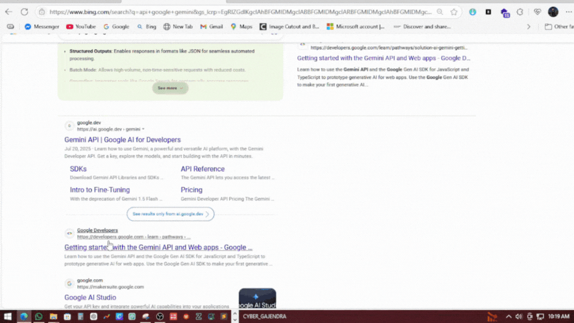
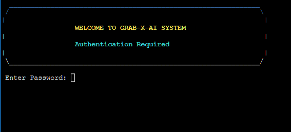
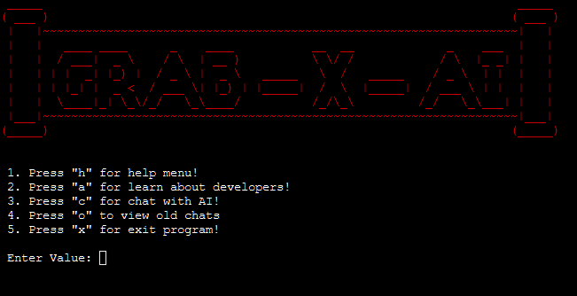
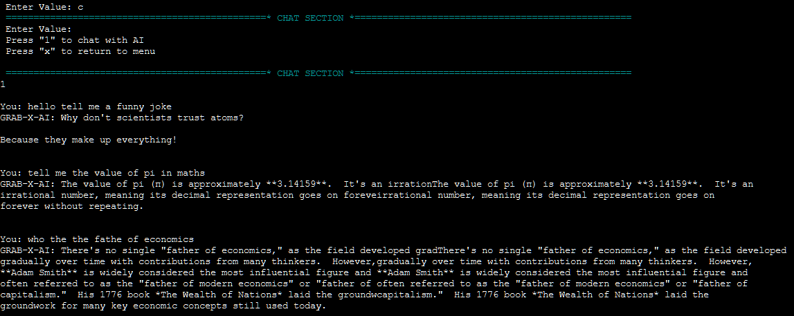
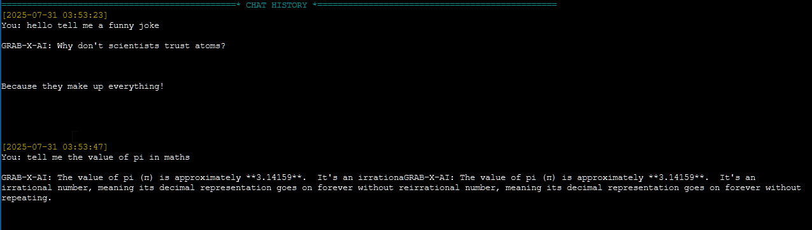

# GRAB-X-AI

GRAB-X-AI is a command-line based AI chatbot application developed in C, designed to interact with users through a terminal interface. It integrates with the Gemini AI API to provide conversational responses, saves chat history, and includes a password-protected authentication system.

## Table of Contents
- [Features](#features)
- [Requirements](#requirements)
- [Installation](#installation)
- [Usage](#usage)
- [Developer Information](#developer-information)
- [Screenshots](#screenshots)
- [License](#license)

## Features
- **Password Authentication**: Secure login with a default password (`cybgaz`).
- **Interactive Menu**: User-friendly menu with options to chat, view history, get help, or learn about developers.
- **AI Chat Integration**: Powered by the Gemini API for natural language responses.
- **Chat History**: Saves conversations in both plain text (`chat.txt`) and JSON (`chat_history.json`) formats.
- **Formatted Output**: Text wrapping and centered text for better readability in terminals.
- **Cross-Platform Compatibility**: Works on Unix-like systems (Linux, macOS) and Windows with minimal adjustments.

## Requirements
To run GRAB-X-AI, ensure you have the following:

### Software
- **C Compiler**: GCC or any compatible C compiler.
- **cURL**: Required for making API requests to the Gemini API.
- **Operating System**: Linux, macOS, or Windows (with Cygwin/MinGW for Windows compatibility).
- **Terminal**: A terminal emulator supporting ANSI escape codes for colored output.

### Dependencies
- Standard C libraries (`stdio.h`, `stdlib.h`, `string.h`, `stdbool.h`, `unistd.h`, `time.h`, `ctype.h`).
- Internet connection for API communication.

### API Key
- A valid **Gemini API Key** (replace the placeholder in the code with your own key).
- Obtain your API key from [Gemini API Google DEV ](https://ai.google.dev/gemini-api/docs/) or the Gemini API provider.
-Video Example

## Installation
1. **Clone the Repository**:
   ```bash
   git clone https://github.com/GajendraAwasthi/Grab-X-AI.git
   cd Grab-X-AI
   ```

2. **Update API Key**:
   - Open `GRAB-X-AI.c` using terminal or else softwares and replace the `API_KEY` constant with your Gemini API key:
     ```c
     //In the Program file ther is section for entering api key enter it like below example
     const char *API_KEY = "Enter-your-api-key-here";
     ```

3. **Compile the Program**:
   - On Linux/macOS:
     ```bash
     gcc -o Grab-X-AI GRAB-X-AI.c
     ```
   - On Windows (with MinGW):
     ```bash
     gcc -o Grab-X-AI.exe GRAB-X-AI.c
     ```

4. **Install cURL** (if not already installed):
   - On Ubuntu/Debian:
     ```bash
     sudo apt-get install curl
     ```
   - On macOS (using Homebrew):
     ```bash
     brew install curl
     ```
   - On Windows, ensure cURL is available in your PATH or use a precompiled binary.

## Usage
1. **Run the Program**:
   ```bash
   ./GRAB-X-AI
   ```
   On Windows:
   ```bash
   GRAB-X-AI.exe
   ```

2. **Authentication**:
   - Enter the default password: `cybgaz` (case-sensitive).
   - You have 3 attempts before the program exits.

3. **Main Menu**:
   - **h**: View the help menu.
   - **a**: Learn about the developers.
   - **c**: Start a chat session with the AI.
   - **o**: View chat history.
   - **x**: Exit the program.

4. **Chat Session**:
   - Press `1` to start chatting.
   - Type your message and press Enter.
   - Press `x` to return to the main menu.
   - Chats are automatically saved to `chat.txt` and `chat_history.json`.

5. **View Chat History**:
   - Select `o` from the main menu to view previous conversations stored in `chat.txt`.

## Developer Information
This project was developed by students of the **National Academy of Science and Technology (NAST)**, BCA Department.

**Team Members**:
- **Gajendra Awasthi**
- **Rejina Pujara**
- **Asmita Bist**
- **Bibhu Srestha**

The project was created as part of an academic initiative to build an AI-powered chatbot with a terminal-based interface.

## Screenshots
Below are some example screenshots of the GRAB-X-AI interface:

### Login Screen


*Description*: The password-protected login interface.

### Main Menu


*Description*: The main menu with options to chat, view history, or get help.

### Chat Session


*Description*: A sample chat session with the AI.

### Chat History


*Description*: Viewing saved chat history.

*Note*: Dont use our files without our permission or without giving us credits

## License
This project is licensed under the MIT License. See the [LICENSE](LICENSE) file for details.
